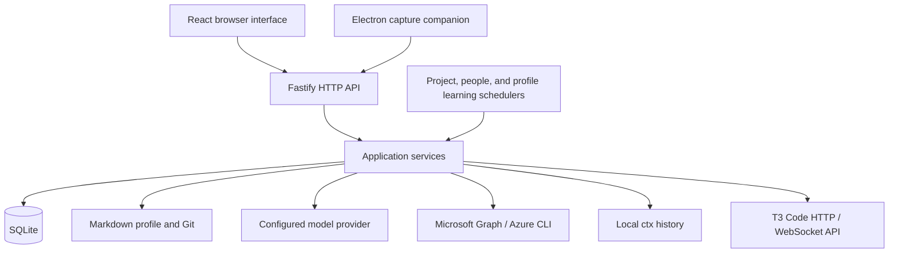

# Architecture

[README](../README.md) · [Contributing](../CONTRIBUTING.md)

Panopticon is a TypeScript application with a React/Vite interface, a Fastify backend, SQLite storage, and an optional Electron companion. The browser and companion use the same local HTTP API.

## Code boundaries

| Location | Responsibility |
| --- | --- |
| `src/` | Browser interface and HTTP client |
| `desktop/` | Menu bar, capture window, backend startup |
| `shared/` | Transport-neutral schemas and value types |
| `server/application/` | Use cases, policy, and capability interfaces |
| `server/app.ts` | Request validation, service calls, HTTP error translation |
| `server/bootstrap.ts` | Adapter construction, service wiring, shutdown |
| `server/main.ts` | HTTP startup, static assets, schedulers |
| Other `server/` modules | SQLite, Git/filesystem, model, directory, and subprocess adapters |
| `prompts/` | Editable model instructions |
| `scripts/` | Setup, validation, installation, scheduling |

Dependency direction is **entry points → application services and ports ← infrastructure adapters**. A port is an interface describing an external capability the application needs.

Application services do not import Fastify, SQLite, filesystem/Git operations, provider SDKs, subprocesses, environment configuration, or the composition root. `shared/` cannot import server code. [Architecture tests](../tests/architecture.test.ts) enforce these boundaries.

## Main workflows

**Capture.** Persist the original text, select context, resolve references, and request model interpretation. Research can retrieve more evidence. Save the result without overwriting concurrent manual edits. Failed processing leaves the capture available for retry.

**Profile note.** Check authorization and serialize incorporation. Give the model a read-only note artifact, including clarification answers and capture date, and the profile location. It uses the shared editing tools to inspect, update, check and commit knowledge directly. The completion tool records the concepts containing the incorporated note, including a verified no-op. Missing information leaves the note pending with the model’s clarification. Revision guards run before writes and commits; failed updates remain pending.

**Profile learning.** Journal original user captures, changed fields, clarification question/answer pairs, labeled conversation messages, and implementation state transitions, scoped to the active profile. A daily task creates artifacts for all activity since the successful checkpoint and provisional memory. The model receives artifact paths and the repository location, then runs a tool loop to read, edit, create, move, delete, inspect diffs, check document structure, and commit. It decides what to retain, infer, refine, or discard and directly performs the edits. The application holds the profile lock, confines file access to profile Markdown and task artifacts, detects external edits, and honors Git hooks. It verifies that no agent edits remain uncommitted before persisting the checkpoint and updated provisional memory. Failures leave activity pending; a crash after a commit may replay activity, which the agent must deduplicate. Conversation events carry recent same-profile messages as historical context for short replies across runs.

**Project discovery.** Enumerate repositories and compare local fingerprints. The configured model reads a project artifact, explores one repository with read-only research tools, and directly maintains profile knowledge with the shared editing and commit tools. Completion requires retrieved evidence and committed edits. Tools check repository identity and source stability; the scanner records fingerprints and availability after success. See [project discovery](project-discovery.md).

**People sync.** Read all Graph pages, normalize and validate records, then replace the profile and tenant's directory in one SQLite transaction. A failed refresh retains the previous snapshot.

**Conversation.** Combine selected profile context, commitments, recent messages, matching people, and explicitly shared session-search results. Return an answer without applying changes.

**Implementation.** Resolve a commitment to a discovered repository, reuse or create its T3 project, and submit a thread/worktree bootstrap command. Persist the task snapshot and command identities before dispatch so retries preserve the original handoff. T3 owns execution and approvals; submission does not complete the commitment.

## Storage

| Data | Default location |
| --- | --- |
| Independent profile Git repository | `~/.local/share/personal-assistant-profile` |
| Captures, revisions, conversations, people, implementation handoffs | `~/.local/share/personal-assistant/assistant.sqlite` |
| Project inventory, profile-page assignments, checkout status, remote findings | `projects` table in the same SQLite database, scoped by profile |
| Learning activity, checkpoint, provisional memory, latest result | `profile_activity` and `profile_learning` tables in SQLite, scoped by profile |
| Credentials and configuration | `~/.local/share/personal-assistant/settings.json` |
| Discovery and sync status | `project-scan.json` and `people-sync.json` in the data directory |

The profile uses OKF v0.2: Markdown concepts with YAML frontmatter and ordinary links. Concept types and filenames are open-ended. Unknown metadata is preserved. Operational state and credentials stay outside the profile.

Profile writes reject stale content and dirty target files, preserve unrelated Git changes, and create local Conventional Commits using existing identity and hooks. Writes across multiple files are not a single atomic transaction: interruptions or commit failures can leave saved changes requiring review. Nothing is automatically pushed.

Switching profiles retains captures. People snapshots are isolated by profile and tenant. The profile alone is not a complete application backup.

## Data and model access

Local storage does not mean local model processing. Requests can send:

- Capture text, core and relevant profile documents, related items, and current commitments.
- Additional profile files, discovered-project files, and CTX evidence retrieved during capture refinement.
- Project task artifacts, repository evidence and profile documents selected by the project agent, including personal notes and metadata when read.
- The note artifact, including clarification answers and capture date, and profile documents selected by the note agent.
- Profile documents, the activity artifact, and provisional memory as the daily learning agent reads them with its tools. The model receives file locations first and chooses its reads; the application does not truncate the pending activity or impose call-count budgets. Activity starts being journaled with this version; older unscoped records are not backfilled.
- Recent conversation messages and selected people candidates. Manual CTX search results require explicit sharing in Conversation.

Model requests, including project discovery, use the configured endpoint and credentials with `store: false`; provider retention policies still apply. Keys stay on the server.

Explicit implementation handoffs send the saved task and linked context to T3 Code's separately configured endpoint. T3 uses its own provider credentials and retention settings. The backend stores pairing-derived session credentials and exposes only connection metadata to the browser.

Research tools are read-only and exclude symlinks, paths outside configured roots, common credential files, and generated directories. Normal source files can still contain secrets. Configure only trusted roots.

Capture refinement uses the configured provider's hosted `web_search` tool to open relevant capture links and research public context. Retrieved URLs and provider URL citations can be retained as sources. The research prompt treats web content as untrusted evidence and instructs the model to keep private context out of search queries. Inaccessible links that leave material gaps require clarification.

Capture refinement permits 100 tool calls, including hosted web calls, over 15 minutes, up to 400,000 accumulated context characters, plus a two-minute finalization allowance. File reads use 12,000-character pages and reject files larger than 2 MiB. Unresolved evidence gaps require review and cannot authorize a profile update.

The service binds to `127.0.0.1` for one local user. General-purpose shell execution and MCP are not connected to capture research or project discovery. Discovery has read-only research access to the selected repository and editing tools confined to profile Markdown. It has no session-history access or source-repository write tools. See [project discovery](project-discovery.md#exploration-and-updates).
