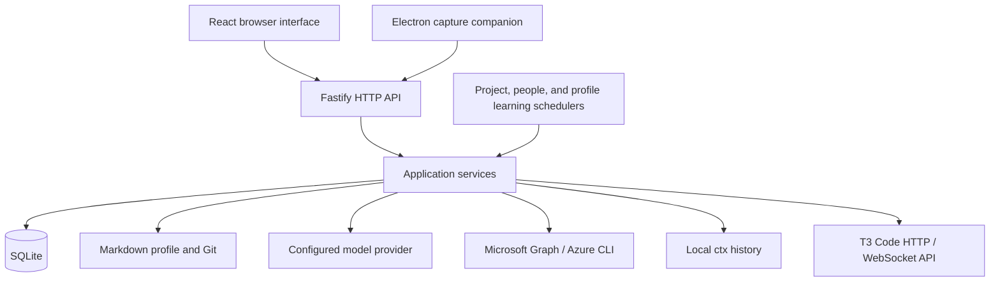

# Architecture

[README](../README.md) · [Contributing](../CONTRIBUTING.md)

Panopticon is a TypeScript application with a React/Vite interface, a Fastify backend, SQLite storage, and an optional Electron companion. The browser and companion use the same local HTTP API.

## Code boundaries

| Location | Responsibility |
| --- | --- |
| `src/` | Browser interface and HTTP client |
| `desktop/` | Menu bar, capture window, backend startup |
| `shared/` | Transport-neutral schemas and value types |
| `server/application/` | Use cases, policy, and capability interfaces |
| `server/app.ts` | Request validation, service calls, HTTP error translation |
| `server/bootstrap.ts` | Adapter construction, service wiring, shutdown |
| `server/main.ts` | HTTP startup, static assets, schedulers |
| Other `server/` modules | SQLite, Git/filesystem, model, directory, and subprocess adapters |
| `prompts/` | Editable model instructions |
| `scripts/` | Setup, validation, installation, scheduling |

Dependency direction is **entry points → application services and ports ← infrastructure adapters**. A port is an interface describing an external capability the application needs.

Application services do not import Fastify, SQLite, filesystem/Git operations, provider SDKs, subprocesses, environment configuration, or the composition root. `shared/` cannot import server code. [Architecture tests](../tests/architecture.test.ts) enforce these boundaries.

## Main workflows

**Capture.** Persist original text and supply the current capture with saved answers, prior refinement, explicit selections and summaries of linked outcomes. Always include core Profile and Working rules documents, plus project names, descriptions and profile-document pointers. Refinement interprets intent rather than investigating implementation. The model retrieves missing intent from CTX history, profile knowledge, Entra people or captures, then uses tools to save refinements, split linked outcomes and incorporate scoped knowledge notes. Searches return concise matches; detailed captures and revision history are separate reads. Ordinary tasks and implementation tasks have separate execution modes independent of project membership. Tool boundaries validate references, citation provenance, ownership and revisions without deriving replacement content. Independent reads can run together; changes execute in order. The model normally ends with `save_refinement` using `complete: true`, saving the final outcome and checking completion in one tool call. Intermediate saves use `complete: false`; `complete_refinement` remains available after inspecting profile incorporation. Both completion paths require all outcomes saved and notes handled, and must be the last call. Reference candidate IDs identify the mention and target rather than a changing list position. Candidate evidence is reused within a run, and repeated selections of retained references are idempotent. Failed processing leaves the capture available for retry.

Clarification conversations are persisted in `refinement_sessions`, keyed by profile and capture. They retain the full Responses input/output history, tool results, citation provenance and encrypted reasoning when supplied by the provider. Requests remain `store: false`; resumption replays the local conversation and appends the latest capture and answers. Completed outcomes discard their session; unresolved linked outcomes retain their own copy. Manual edits and reference resets discard stale sessions. Model, endpoint, prompt and tool-schema changes prevent incompatible replay. Failed continuations preserve the previous checkpoint.

The backend writes JSON lines with `level: "debug"` and events prefixed `capture_refinement.` to `refinement.debug.jsonl` in the application data directory. Each run has a run ID, capture ID and model, with start/finish records for model requests and local tool calls. Records include durations, request/output character counts, tool names, success/failure, provider timeout/status information and provider-reported token usage when available. A final record summarizes the run, including failures. `usageRequests` identifies how many requests supplied token usage; totals cover only those requests and are null when none supplied it. Hosted web calls are counted separately, with their time included in the model request. These performance records omit capture text, tool arguments/results, credentials and provider error bodies. Refinement traces do not go to standard output, including under `mise run dev`. New log files are owner-readable/writable only. Operational errors remain on the console; a trace-file write failure is reported without interrupting refinement.

Final summaries also persist in `refinement_runs`, scoped to the profile. CTX measurements count searches, event reads, failed calls, request rounds containing CTX calls, retrieved event sources and successfully cited event sources. Tool duration is summed across calls and may overlap; it does not measure the full latency caused by CTX. Overall elapsed time, model-request time and provider token usage provide comparison context. Resumed runs identify prior CTX lookups and evidence separately from new calls. The completing save or standalone completion call includes the model's brief assessment (essential, helpful, unnecessary or harmful), or null when unused. Missing or malformed assessments are discarded without blocking completion or requesting repairs; null therefore also means no valid assessment was supplied. Its explanation stays in the local database rather than the debug log or the task description. This is self-reported usefulness, not a controlled comparison or proof of accuracy. No extra evaluation request is made.

**Profile note.** Serialize incorporation of clear knowledge notes or explicitly submitted notes. Give the model a read-only note artifact, including clarification answers and capture date, and the profile location. It uses the shared editing tools to inspect, update, check and commit knowledge directly. The completion tool records the concepts containing the incorporated note, including a verified no-op. Missing information leaves the note pending with the model’s clarification. Revision guards run before writes and commits; failed updates remain pending.

**Profile learning.** Journal original user captures, changed fields, clarification question/answer pairs, labeled conversation messages, and implementation state transitions, scoped to the active profile. A daily task creates artifacts for all activity since the successful checkpoint and provisional memory. The model receives artifact paths and the repository location, then runs a tool loop to read, edit, create, move, delete, inspect diffs, check document structure, and commit. It decides what to retain, infer, refine, or discard and directly performs the edits. The application holds the profile lock, confines file access to profile Markdown and task artifacts, detects external edits, and honors Git hooks. It verifies that no agent edits remain uncommitted before persisting the checkpoint and updated provisional memory. Failures leave activity pending; a crash after a commit may replay activity, which the agent must deduplicate. Conversation events carry recent same-profile messages as historical context for short replies across runs.

**Project discovery.** Enumerate repositories and compare local fingerprints. The configured model reads a project artifact, explores one repository with read-only research tools, and directly maintains profile knowledge with the shared editing and commit tools. Completion requires retrieved evidence and committed edits. Tools check repository identity and source stability; completion commits knowledge and accepted repository metadata together. See [project discovery](project-discovery.md).

**People sync.** Read all Graph pages, normalize and validate records, then replace the profile and tenant's directory in one SQLite transaction. A failed refresh retains the previous snapshot.

**Conversation.** Combine selected profile context, commitments, recent messages, matching people, and explicitly shared session-search results. Return an answer without applying changes.

**Implementation.** Resolve a commitment to a discovered repository, reuse or create its T3 project, and submit a thread/worktree bootstrap command. Persist the task snapshot and command identities before dispatch so retries preserve the original handoff. T3 owns execution and approvals; submission does not complete the commitment.

Successful capture refinement invokes the same serialized handoff after saving its result when auto-start is enabled. Project overrides use nullish precedence over global settings, with missing values defaulting to false. Eligibility is checked against the saved revision, readiness, prompt, clarifications, and available repository before dispatch. Auto-start failures are persisted separately from refinement errors. Submitted implementations are reused; pending retries preserve their thread identity. Automatic handoff messages explicitly limit authorization to implementation, excluding publishing and other shared-system changes.

## Storage

| Data | Default location |
| --- | --- |
| Independent profile Git repository | `~/.local/share/personal-assistant-profile` |
| Captures, revisions, conversations, people, implementation handoffs | `~/.local/share/personal-assistant/assistant.sqlite` |
| Project inventory, profile-page assignments, checkout status, remote findings | `projects` table in the same SQLite database, scoped by profile |
| Learning activity, checkpoint, provisional memory, latest result | `profile_activity` and `profile_learning` tables in SQLite, scoped by profile |
| Credentials and configuration | `~/.local/share/personal-assistant/settings.json` |
| Discovery and sync status | `project-scan.json` and `people-sync.json` in the data directory |

The profile uses OKF v0.2: Markdown concepts with YAML frontmatter and ordinary links. Concept types and filenames are open-ended. Unknown metadata is preserved. Operational state and credentials stay outside the profile.

Profile writes reject stale content and dirty target files, preserve unrelated Git changes, and create local Conventional Commits using existing identity and hooks. Writes across multiple files are not a single atomic transaction: interruptions or commit failures can leave saved changes. A task-specific journal in the profile Git directory records original and intended file contents before each mutation. Retries recover only drafts matching their committed baseline and working/staged contents; other edits remain protected. Nothing is automatically pushed.

Switching profiles retains captures. People snapshots are isolated by profile and tenant. The profile alone is not a complete application backup.

## Data and model access

Local storage does not mean local model processing. Requests can send:

- Capture text, saved answers, previous refined content, explicit selections, linked-outcome summaries and available profile/project scopes.
- Profile files, Entra people and relationships, captures and revision history, project descriptions, and CTX evidence selected through tools during capture refinement. Repository implementation details are left to the executing agent.
- Project task artifacts, repository evidence and profile documents selected by the project agent, including personal notes and metadata when read.
- The note artifact, including clarification answers and capture date, and profile documents selected by the note agent.
- Profile documents, the activity artifact, and provisional memory as the daily learning agent reads them with its tools. The model receives file locations first and chooses its reads; the application does not truncate the pending activity or impose call-count budgets. Activity starts being journaled with this version; older unscoped records are not backfilled.
- Recent conversation messages, selected profile documents, related items, current commitments and selected people candidates for Conversation. Manual CTX search results require explicit sharing in Conversation.

Model requests, including project discovery, use the configured endpoint and credentials with `store: false`; provider retention policies still apply. Keys stay on the server.

Manual and opted-in automatic implementation handoffs send the saved prompt to T3 Code's separately configured endpoint. T3 uses its own provider credentials and retention settings. The backend stores pairing-derived session credentials and exposes only connection metadata to the browser.

Research tools are read-only and exclude symlinks, paths outside configured roots, common credential files, and generated directories. Normal source files can still contain secrets. Configure only trusted roots.

Capture refinement uses the configured provider's hosted `web_search` tool to open relevant capture links and research public context. Retrieved URLs and provider URL citations can be retained as sources. The research prompt treats web content as untrusted evidence and instructs the model to keep private context out of search queries. Inaccessible links that leave material gaps require clarification.

Capture refinement lets the model decide which evidence to retrieve and when its saved outcomes are complete, without arbitrary call-count or accumulated-context budgets. File reads use 12,000-character pages and reject files larger than 2 MiB. Only material unresolved gaps require clarification before dependent profile updates.

The service binds to `127.0.0.1` for one local user. General-purpose shell execution and MCP are not connected to capture research or project discovery. Discovery has read-only research access to the selected repository and editing tools confined to profile Markdown. It has no session-history access or source-repository write tools. See [project discovery](project-discovery.md#exploration-and-updates).
